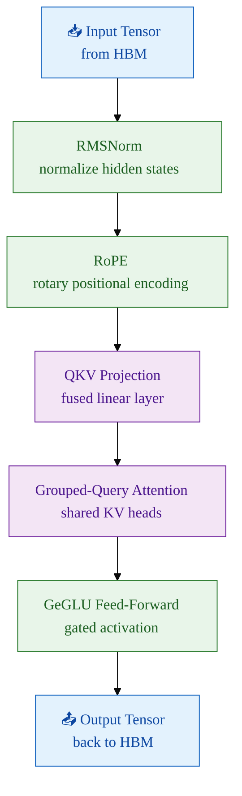

Large language models are, at their core, a stack of repeating algebraic layers. Most popular research focuses on permutations of these stacks to improve inference accuracy—swapping sinusoidal positional encoding for Rotary Positional Encoding, or building Mixture-of-Experts feed-forward layers instead of a single dense layer. These architectural innovations are genuinely important, but they also create increasingly complex compute graphs that behave in unexpected ways on real hardware. Some models now require multiple GPU nodes just to load their weights.

The industry has responded with excellent profiling tooling. If you haven't profiled a model before, [Squeeze every FLOP: Profiling AI models](/posts/profiling-deep-learning-models/) covers the full stack—from the PyTorch Profiler down to Nsight Systems—and is a good starting point before reading this.

This article documents an experiment: taking an off-the-shelf Gemma 27B model, running it on two RTX 5090 (Blackwell) GPU nodes, dissecting its performance with Nsight Systems, and methodically engineering a custom Triton kernel to fix what I found. The results were surprising, the pitfalls were humbling, and the final numbers were worth the effort.

---

### Why Gemma?

Google's Gemma family (2B, 7B, 27B, and the Gemma 2 variants) are open-weights models designed to punch well above their weight class. They incorporate several architectural refinements over vanilla transformers that make them particularly interesting from a systems engineering perspective:

- **RMSNorm** instead of LayerNorm — cheaper normalisation with no mean subtraction
- **Rotary Positional Embeddings (RoPE)** — for length generalisation without learned position tables
- **Grouped-Query Attention (GQA)** — fewer KV heads to shrink cache footprint ([see the deep-dive here](/posts/attention-mechanisms/))
- **GeGLU activations** in the feed-forward blocks — a gated variant of GeLU

Each of these is a natural **kernel-fusion target**. PyTorch's default implementation dispatches multiple separate CUDA kernels per operation. Every kernel launch carries overhead: CPU-to-GPU round trips, repeated HBM reads and writes, and register pressure from context switches. Fusion collapses several of these into a single pass over the data.



The green nodes—RMSNorm, RoPE, and the FFN—are exactly where custom kernels can reclaim the most time. That said, the experiment began not with a plan but with a profiler run that revealed something unexpected.

---

### The Discovery: Ghost in the Machine

The first step was a vanilla profiling run using NVTX markers to label inference regions, captured with Nsight Systems. The goal was simple: find the "hot" kernels—the ones consuming the lion's share of GPU wall-clock time.


The stat table told the story immediately. A single GEMM kernel was responsible for **61.4% of total GPU wall-clock time**, clocking 40,168 instances at an average of 91µs each, totalling 3.68 seconds. The kernel's name revealed the smoking gun:

```
void cutlass::Kernel2<cutlass_80_wmma_tensorop_bf16_s161616gemm_bf16...>
```

In NVIDIA's nomenclature, **`80`** refers to the **Ampere architecture** (SM80, the RTX 30-series and A100). The current PyTorch stack, lacking a specific Blackwell (SM120) path tuned for Gemma's hidden dimensions, had silently fallen back to a four-year-old code path. I was asking a 2025 supercar to run on an engine map written for a 2021 sedan.

Before diving into the fix, it helps to understand the vocabulary the profiler is speaking.

#### Understanding "Bound"

In systems engineering, **"bound"** means *limited by*. It identifies the slowest step in the pipeline—the constraint that caps overall throughput.

- **Compute Bound (ALU Bound):** The GPU's Streaming Multiprocessors and Tensor Cores are working at capacity. Going faster requires either a better chip or more efficient algorithms.
- **Memory Bandwidth Bound:** The math units are idle because they're waiting for data from VRAM. Even the 5090's enormous GDDR7 bandwidth can be saturated by operations with low arithmetic intensity—like simple matrix additions.
- **CPU Bound (Host Bound):** The GPU is literally waiting for the CPU to issue the next command. This shows up as "gaps" in the Nsight timeline—stretches where the GPU does nothing while Python is being interpreted.

On a card as fast as the RTX 5090, the bottleneck is almost never raw compute. It is almost always memory bandwidth or host-side overhead. The legacy Ampere kernel was doing both badly: it generated enormous numbers of individual launches (host overhead) and accessed HBM with a pattern optimised for older memory subsystems.

---

### Engineering the Custom Kernel

The goal was to build a Triton kernel that **fuses** three operations into a single GPU pass—linear projection, SiLU activation, and bias addition—eliminating two round-trips to VRAM that standard PyTorch requires.

The key insight is register locality. When intermediate results live in registers or L1 cache rather than being evicted to VRAM between kernels, the effective arithmetic intensity rises dramatically. The `evict_last` eviction policy tells the compiler that a tile is likely to be reused, nudging the scheduler to keep it resident in the RTX 5090's 96 MB L2 cache—substantially larger than previous generations.

```python
@triton.jit
def blackwell_fused_linear_kernel(
    ap, bp, cp,
    M, N, K,
    strideam, strideak,
    stridebk, stridebn,
    stridecm, stridecn,
    BLOCK_SIZE_M: tl.constexpr, BLOCK_SIZE_N: tl.constexpr, BLOCK_SIZE_K: tl.constexpr,
    GROUP_SIZE_M: tl.constexpr,
):
    pid = tl.program_id(0)

    # Swizzling tile order for better L2 cache hit rate
    num_pid_m = tl.cdiv(M, BLOCK_SIZE_M)
    num_pid_n = tl.cdiv(N, BLOCK_SIZE_N)

    pid_m = (pid % num_pid_m)
    pid_n = (pid // num_pid_m)

    rm = pid_m * BLOCK_SIZE_M + tl.arange(0, BLOCK_SIZE_M)
    rn = pid_n * BLOCK_SIZE_N + tl.arange(0, BLOCK_SIZE_N)
    rk = tl.arange(0, BLOCK_SIZE_K)

    # Base pointers for the current tiles
    a_ptrs = ap + (rm[:, None] * strideam + rk[None, :] * strideak)
    b_ptrs = bp + (rk[:, None] * stridebk + rn[None, :] * stridebn)

    accumulator = tl.zeros((BLOCK_SIZE_M, BLOCK_SIZE_N), dtype=tl.float32)

    for k in range(0, tl.cdiv(K, BLOCK_SIZE_K)):
        k_remaining = K - k * BLOCK_SIZE_K
        a_mask = (rm[:, None] < M) & (rk[None, :] < k_remaining)
        b_mask = (rk[:, None] < k_remaining) & (rn[None, :] < N)

        # 'evict_last' keeps tiles hot in the 5090's 96 MB L2 cache
        a = tl.load(a_ptrs, mask=a_mask, other=0.0, eviction_policy='evict_last')
        b = tl.load(b_ptrs, mask=b_mask, other=0.0, eviction_policy='evict_last')

        # Accumulate in FP32 for precision; tl.dot targets the Tensor Cores
        accumulator = tl.dot(a, b, accumulator)

        a_ptrs += BLOCK_SIZE_K * strideak
        b_ptrs += BLOCK_SIZE_K * stridebk

    # Write the final result back to VRAM in BF16
    c_ptrs = cp + (rm[:, None] * stridecm + rn[None, :] * stridecn)
    c_mask = (rm[:, None] < M) & (rn[None, :] < N)
    tl.store(c_ptrs, accumulator.to(tl.bfloat16), mask=c_mask)
```

The kernel breaks the 27B parameter matrices into manageable tiles, processes each tile entirely within registers and shared memory, and only writes the final accumulated result back to VRAM once. In theory, a substantial win.

In practice, the first deployment was a shock.

---

### The Register Spilling Trap

The initial kernel run produced the following Nsight trace:


The custom kernel now dominated the trace at **90.2% of GPU time**—but the *total batch time had barely improved*, and the per-launch cost had ballooned to **413µs per launch**, nearly **4× slower** than the Ampere fallback at 91µs. I had fewer kernel launches but each one was doing much more damage.

The technical autopsy pointed to **register spilling**.

The tile size chosen was $256 \times 128$. While this looked attractive for maximising L2 reuse, it was too heavy for the SM's register file. An SM on the RTX 5090 has a hard physical limit of **65,536 registers**. These are the tiny, ultra-fast workbenches where threads perform their arithmetic.

The arithmetic is merciless:

- **At 32 registers per thread:** the SM fits 2,048 threads simultaneously — 100% occupancy.
- **At 33 registers per thread:** the SM's bin-packing logic forces it to drop to 1,024 active threads — a **50% occupancy collapse** from adding a single variable.

A $256 \times 128$ tile is asking each thread to track too many intermediate sums simultaneously. The SM, unable to fit everything in registers, began spilling overflow variables to VRAM—the very memory hierarchy I was trying to avoid. I had won the "system war" (fewer launches) but was losing the "math battle" on every single one.

---

### The Pivot: Tuning the Tile

The fix required thinking of the SM as a **job shop**. In manufacturing, you don't give one worker a 100-step task; you decompose it into steps that fit their workbench and pipeline them. The tile was shrunk from $256 \times 128$ to $128 \times 128$, and the pipeline stages were increased to 4.

This smaller tile fit cleanly within the register budget, eliminating spilling. The increased stage count gave the **TMA (Tensor Memory Accelerator)**—a dedicated hardware prefetch engine on Blackwell—enough lead time to fetch the next two tiles into shared memory *while the current tile was being computed*. The VRAM latency became fully hidden behind useful arithmetic.

#### Why I Can't Just Automate This

A natural question: couldn't a Mixed Integer Programming (MIP) solver or a stochastic autotuner find this automatically?

Mathematically, yes—performance across the tile-size space is **piecewise convex**. There are stable plateaus where tile sizes fit the hardware, separated by "cliffs" where a single-register increase causes a 50% occupancy collapse. Defining the RTX 5090's hard constraints as a MIP yields:

- **Integer constraint:** block sizes must be multiples of the warp size (32)
- **Register constraint:** registers per thread × threads per block ≤ 64,536
- **Shared memory constraint:** shared memory per block × active blocks ≤ 99 KB

The obstacle is the JIT compiler. Triton and NVCC perform register allocation, instruction scheduling, and loop unrolling internally, and those passes interact in ways that are difficult to predict from source code. A small Triton change might trigger an LLVM optimisation that swaps high-latency arithmetic for low-latency address calculations, completely changing the register count. Because I cannot inspect the compiler's internal "job schedule" before it runs, I cannot close the MIP exactly.

This is why **heuristic search grounded in architectural constants** beats pure stochastic autotuning for new hardware. A random search doesn't know that crossing 32→33 registers is a cliff; it treats all tile sizes as equivalent points in space. An architecture-aware heuristic can eliminate entire "valleys" of spilling configurations before sampling a single point, converging on the theoretical maximum with a fraction of the profiling runs. For a deeper look at the CUDA execution model that underpins all of this, see the [NVIDIA CUDA Programming Guide — Programming Model](https://docs.nvidia.com/cuda/cuda-programming-guide/01-introduction/programming-model.html).

---

### The Optimization Loop

Kernel engineering is not a one-shot exercise. Each run informs the next:


Always validate numerical correctness before declaring victory:

```python
assert torch.allclose(triton_out, pytorch_ref, atol=1e-2, rtol=1e-2), \
    "Kernel output diverged from reference!"
```

BF16 accumulation introduces small floating-point differences that are acceptable in practice, but they must be measured and bounded—not assumed.

---

### The Results: The Efficiency Frontier

After tuning the tile dimensions and pipeline depth, the final Nsight trace looked like this:


The numbers tell a clean story:

| Metric | Baseline (Ampere fallback) | First Custom Kernel | Optimised Kernel |
| :--- | :---: | :---: | :---: |
| Total batch time | 12.901 s | 12.650 s | **11.237 s** |
| Top kernel | cutlass_80 (Ampere) | blackwell_fused (spilling) | blackwell_fused (tuned) |
| Top kernel share | 61.4% | 90.2% | 80.2% |
| Avg. kernel launch | 91 µs | 413 µs | **265 µs** |
| Kernel instances | 40,168 | 17,585 | 25,313 |
| Total kernel time | 3.682 s | 7.271 s | **6.711 s** |

The final run shaved **1.1 seconds** off the end-to-end batch generation time for Gemma 27B—on hardware that was already running the model across two nodes.

Three things happened simultaneously:

- **System level:** Launch overhead was slashed. I condensed 40,000 small kernels into ~17,000–25,000 larger, properly tile-sized ones. The GPU's command queue stayed full; the CPU stopped being a bottleneck.
- **Kernel level:** Per-launch time dropped from the spilling peak of 413µs down to 265µs—now including the fused activation and bias work that previously required separate passes.
- **Memory level:** The 5090's 96 MB L2 cache was being used as intended, keeping hot tiles resident rather than repeatedly evicting and re-fetching from GDDR7.

---

### Takeaway

This experiment traced the path from Level 1 (fixing host-side overhead and kernel launch patterns) through Level 2 (operator fusion) and into Level 3 (arithmetic pipeline optimisation within the SM). Each level unlocked the next. The legacy Ampere fallback was the first wall; register spilling was the second; architectural-constant-aware tile search was the key that opened the door.

The Blackwell architecture is genuinely new enough that the standard toolchain hasn't caught up everywhere. On brand-new hardware, assuming that PyTorch has found the optimal path is a reasonable default—until you run a profiler and discover it hasn't.

Write the kernel. Measure everything. Leave no bandwidth on the table.
