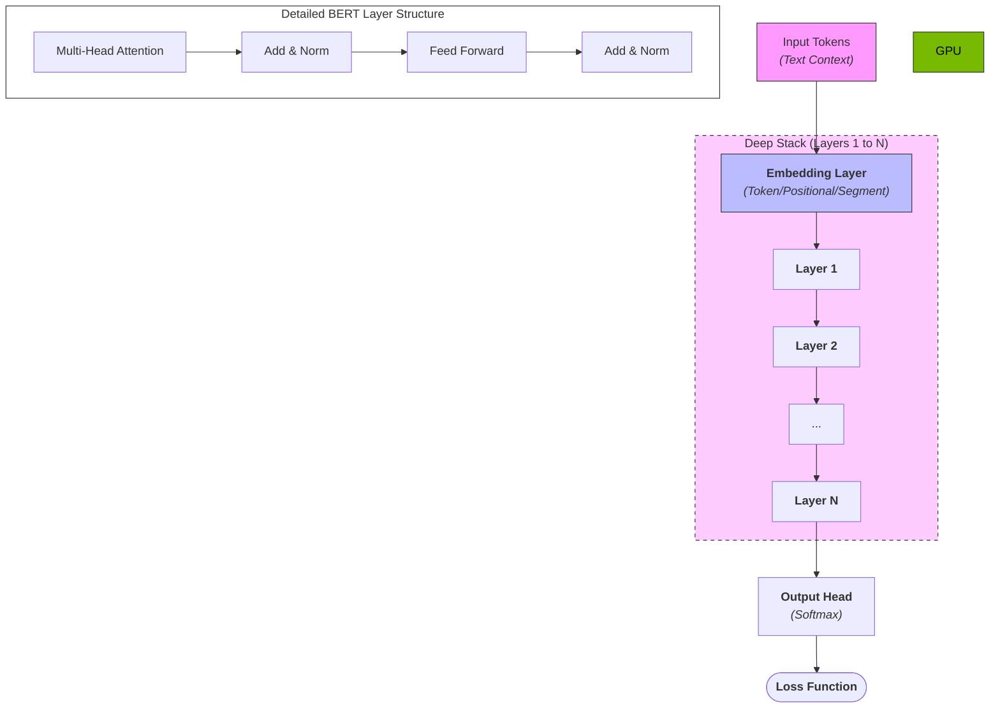
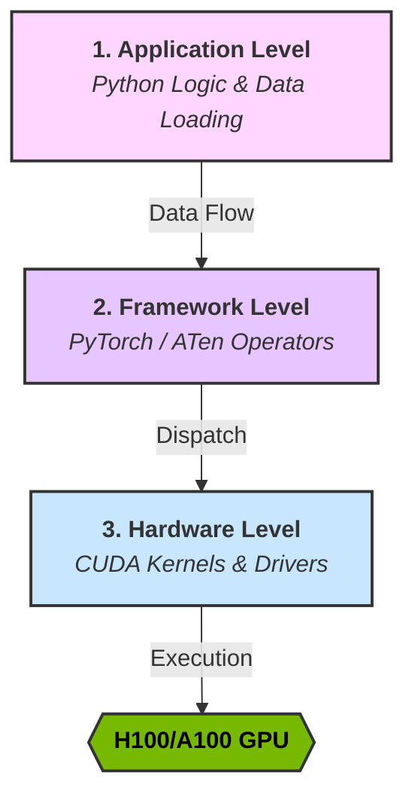

Getting a model to train and converge is only half the battle. When you’re scaling up to large models on enterprise hardware—especially when orchestrating jobs across a heavy compute cluster—leaving performance on the table isn’t an option.

Why do we profile? Because modern deep learning frameworks abstract away the hardware so well that it's dangerously easy to write inefficient code. Profiling moves optimization from a guessing game to a precise science.

### The Test Subject: BERT Architecture

To keep things grounded, we'll use a standard BERT model as our running example. Transformers like BERT are highly parallelizable but notoriously memory-hungry, making them excellent candidates for profiling.

### BERT Model Flowchart



**How BERT Works (Simply):**

1. **Embeddings:** Converts words into numbers that represent their meaning.
2. **Attention Layers:** Allows the model to look at every word in a sentence simultaneously to understand context (e.g., "bank" in "river bank" vs "bank account").
3. **Feed Forward:** Processes the context-aware information from the attention layers.
4. **The Stack:** BERT repeats this process many times (Layers 1 to N) to build a deep understanding of language.

---

### The Three Levels of Profiling

Before diving into the tools, it helps to understand the "stack" we are interrogating. Profiling generally falls into three levels:



1. **Application Level:** How long does data loading take? Is the CPU keeping the GPU fed?
2. **Framework Level (PyTorch):** Which specific math operations (like matrix multiplies) are taking the most time?
3. **Hardware Level (CUDA):** What is happening at the OS and driver level? Are there gaps in GPU execution because the hardware is waiting for data?

---

### Level 1 & 2: The PyTorch Profiler

The PyTorch Profiler is built for the Application and Framework levels. It correlates Python code with underlying PyTorch math (ATen) operators and CUDA calls.

### Implementing the Profiler

Wrapping your training loop with the profiler is straightforward. We use a `schedule` to avoid profiling the entire run, which would generate unmanageably large files.

```python
import torch
from transformers import BertModel, BertConfig
from torch.profiler import profile, record_function, ProfilerActivity, schedule

# Setup dummy BERT and data
device = torch.device("cuda" if torch.cuda.is_available() else "cpu")
model = BertModel(BertConfig()).to(device)
inputs = torch.randint(0, 2000, (16, 128)).to(device)

# Define schedule: Wait 1 step, Warmup 1, Profile 2
prof_schedule = schedule(skip_first=2, wait=1, warmup=1, active=2, repeat=1)

with profile(
    activities=[ProfilerActivity.CPU, ProfilerActivity.CUDA],
    schedule=prof_schedule,
    on_trace_ready=torch.profiler.tensorboard_trace_handler('./log/bert_profile'),
    record_shapes=True,
    profile_memory=True,
    with_stack=True
) as prof:
    
    for step in range(7):
        with record_function("forward_pass"):
            outputs = model(inputs)
            loss = outputs.last_hidden_state.sum()
            
        with record_function("backward_pass"):
            loss.backward()
            
        prof.step()
```

### Analyzing the Results

Once you generate the logs, you can view them in TensorBoard. Look for:

* **GPU Time Summary:** If you see "DataLoader" taking high time, your CPU is too slow for your GPU.
* **Operator Breakdown:** See which mathematical operations (like `aten::bmm`) are the bottlenecks.
* **Trace View:** Look for "white space" in the timeline—these are moments your GPU is idle and doing nothing!

---

## Level 3: Nsight Systems (The Ground Truth)

When you need to see exactly what the hardware is doing, you use **NVIDIA Nsight Systems (nsys)**. 

### Instrumenting with NVTX

To get the most out of Nsight, you should instrument your code with **NVTX (NVIDIA Tools Extension)**. This creates labels in the Nsight timeline that correlate with your Python logic.

```python
import torch

# Inside your training loop
for step in range(7):
    # Use context managers to mark specific regions
    with torch.cuda.nvtx.range("forward_pass"):
        outputs = model(inputs)
        loss = outputs.last_hidden_state.sum()

    with torch.cuda.nvtx.range("backward_pass"):
        loss.backward()
        
    torch.cuda.synchronize() # Optional: help isolate kernel timing
```

### Running the Profile

You'll use the `nsys` CLI to capture the trace:

```bash
nsys profile -w true -t cuda,nvtx,osrt -s cpu -o bert_sys_profile python train_bert.py
```


### Finding Bottlenecks in the Trace

In Nsight, you are looking at the bare metal.

1. **The CUDA Hardware Row:** This shows exactly what the GPU is executing. If you see gaps between blocks, your GPU is sitting idle, waiting for the CPU.
2. **The Autograd Engine:** If you see `cudaDeviceSynchronize` calls, you've found a performance killer. It means the CPU is being forced to stop and wait for the GPU unnecessarily.
3. **Background Workers:** These show your data loading threads. If they aren't busy, your data pipeline might be the bottleneck.

### The Takeaway

Optimization is an iterative loop. Start with the **PyTorch Profiler** to find framework-level fixes—like unpinned tensors or `.item()` calls that slow things down. Once the Python-side code is clean, drop down into **Nsight Systems** to keep your compute clusters fully fed.

Squeeze every FLOP. Don't leave performance on the table.
