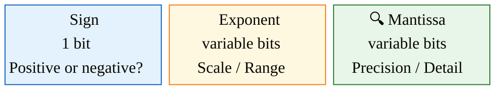
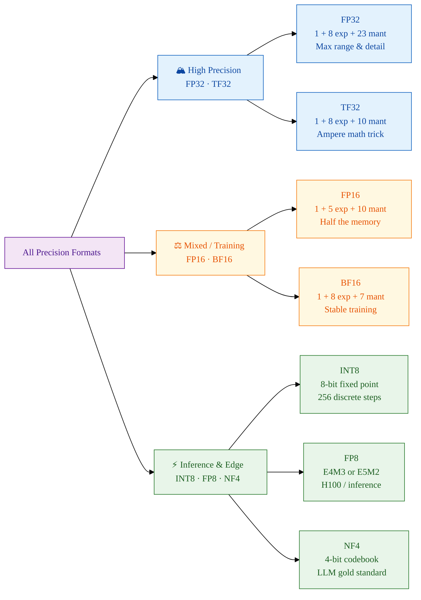
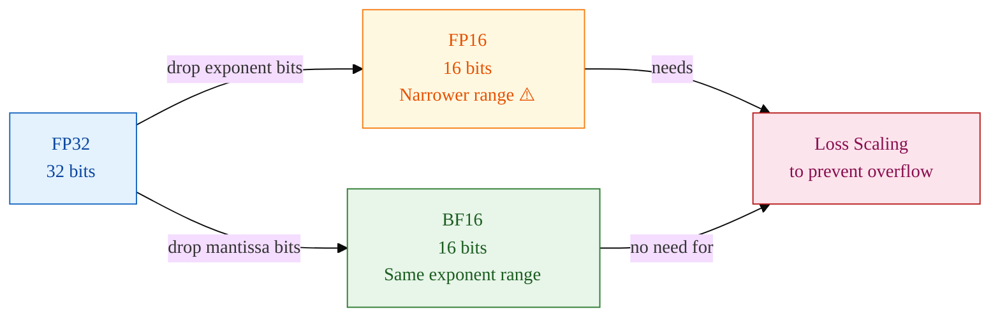
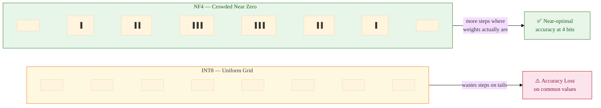
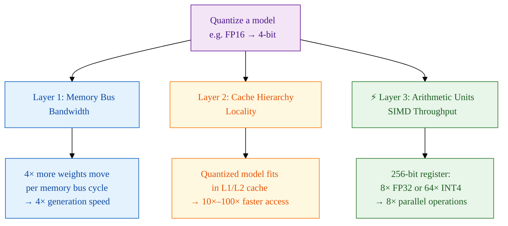
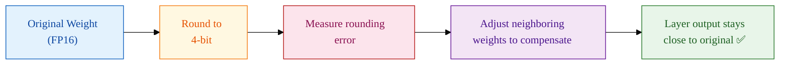
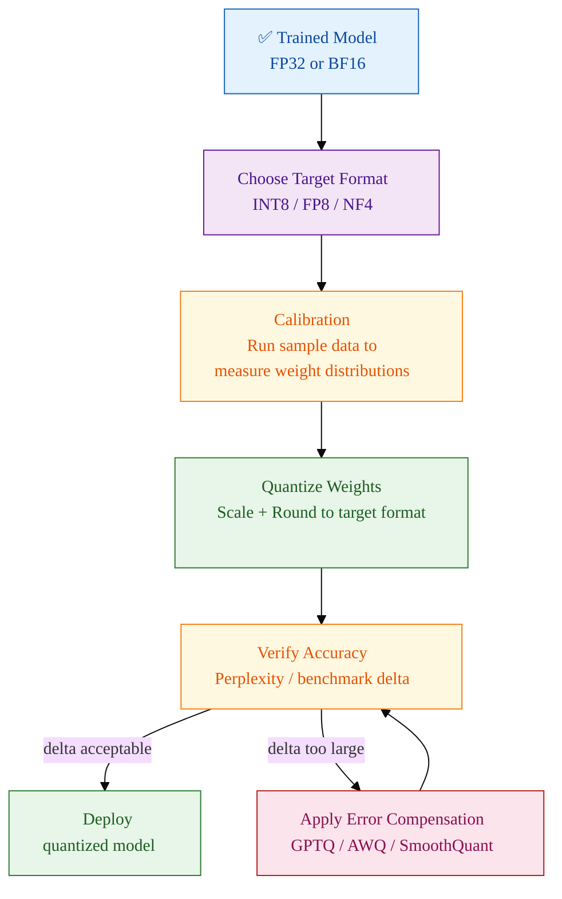

In the early days of deep learning, the primary goal was raw accuracy. Researchers trained models using 32-bit floating-point precision, treating computational resources as an infinite well. However, as the industry moved from million-parameter models to trillion-parameter giants, a physical reality set in: the **Memory Wall**. Getting data *to* the GPU became the bottleneck, not the GPU's ability to crunch numbers.

Quantization — the process of mapping high-precision continuous values to lower-precision discrete sets — has emerged not as a compression trick, but as the fundamental architectural bridge between mathematical theory and hardware reality.

---

### How a Computer Slices a Number

To understand how quantization works, you first need to understand how a computer stores a floating-point number. Most AI precision formats are based on the **IEEE 754 standard**, which splits a number into three fields:

- **Sign bit** — is the number positive or negative?
- **Exponent** — how large or small can the number be? (the *range*)
- **Mantissa** — how many significant digits does it carry? (the *precision*)

The tradeoff is always the same: more exponent bits means wider range; more mantissa bits means finer detail. Quantization is all about choosing the right balance for the task at hand.

---

### The Precision Spectrum

Every format on this spectrum makes a deliberate tradeoff. Here's the full picture before we break each one down:

---

### High-Precision Baselines

#### FP32 — Single Precision

**Bit layout:** `1 Sign | 8 Exponent | 23 Mantissa`

FP32 is the "gold standard" — enormous range and high precision, which is why it was the default for training throughout the 2010s. The problem is cost: every single parameter eats **4 bytes**. A 7B-parameter model needs **28 GB of VRAM** in FP32 before you've even started a forward pass. For modern LLMs, this is simply not viable for inference.

#### TF32 — TensorFloat-32

**Bit layout:** `1 Sign | 8 Exponent | 10 Mantissa` (internal)

TF32 is a clever hardware trick baked into NVIDIA's Ampere architecture (and newer). It accepts FP32 inputs from your code — no changes needed — but internally performs matrix multiplications using only a 10-bit mantissa, matching FP16's precision, while keeping FP32's wide exponent for range. The result is up to a **10× speedup** on matrix math with almost no accuracy loss, completely transparent to the programmer.

---

### Training and Mixed-Precision Formats

#### FP16 — Half Precision

**Bit layout:** `1 Sign | 5 Exponent | 10 Mantissa`

FP16 halves memory usage compared to FP32 and unlocks 2× faster memory throughput. The catch is the **small 5-bit exponent**, which limits the maximum representable value to roughly 65,504. During training, gradients frequently exceed this, causing **overflow** (the value becomes `Inf`) or **underflow** (it collapses to zero). The industry's fix is **Loss Scaling**: multiply the loss by a large constant before the backward pass, then divide the gradients back — a mathematically equivalent workaround that keeps values in range, but one more thing to get wrong.

#### BF16 — Brain Floating Point

**Bit layout:** `1 Sign | 8 Exponent | 7 Mantissa`

Created by Google specifically for machine learning, BF16 makes a different tradeoff: keep FP32's full **8-bit exponent** but shrink the mantissa to 7 bits. The range is now identical to FP32, so the overflow disasters of FP16 simply cannot happen. You lose some decimal-place precision, but neural networks don't need it — they care far more about representing the right *scale* of a gradient than getting the 7th significant digit right. BF16 is now the dominant training format on modern accelerators.

---

### Inference and Quantization Formats

This is where the real magic happens for deployment. The goal shifts from "train stably" to "run fast and cheap."

#### INT8 — 8-bit Integer

**Bit layout:** Fixed-point, 8 bits representing integers from -128 to 127.

Instead of floating-point ranges, INT8 takes the entire distribution of a weight tensor and **squishes** it into 256 discrete steps. The arithmetic is pure integer math, which is dramatically faster on specialized hardware — typically **4×–8× faster** than FP32.

The problem is **outliers**. A few activations in large language models are much larger than the rest. When those outliers define the quantization scale, all the small values get squished into just a few discrete steps, causing accuracy to plummet. Techniques like **SmoothQuant** redistribute these outliers before quantization to mitigate this.

#### FP8 — 8-bit Floating Point

**Two versions:**

- **E4M3** — 4 exponent bits, 3 mantissa bits → prioritizes precision
- **E5M2** — 5 exponent bits, 2 mantissa bits → prioritizes range

FP8 brings floating-point flexibility down to the speed of 8-bit operations. NVIDIA's H100 has dedicated FP8 Tensor Cores. Unlike INT8, FP8 handles varying scales naturally because the exponent adjusts dynamically. This also makes **8-bit training** possible for the first time — previously you needed at least 16 bits to train stably.

#### NF4 — 4-bit NormalFloat

**Layout:** A specialized lookup table (codebook) of 16 values.

NF4 is the smartest format on this list. It doesn't try to linearly divide a range. Instead, it exploits a known fact about neural networks: **weights follow a normal distribution** (a bell curve centered at zero). NF4 places its 16 quantization levels non-uniformly — crowded together near zero where most weights live, spread out at the tails. This is **information-theoretically optimal** for normally distributed data.

NF4 is the format used by **QLoRA** (Quantized Low-Rank Adaptation) and is why you can now fine-tune a 70B parameter model on a single consumer GPU. It reduces VRAM usage by **4× compared to FP16**, with near-identical accuracy for generation tasks.

---

### Why "Smaller" is "Faster": The Physics

Quantization doesn't just save memory — it fundamentally changes how the hardware operates, across three physical layers:

For most modern LLMs, **memory bandwidth** is the primary bottleneck — not raw compute. The GPU's Tensor Cores sit idle waiting for the next batch of weights to arrive from VRAM. Quantization directly attacks this bottleneck: by shrinking the data, you move more of it in less time.

---

### Why Doesn't Accuracy Collapse?

The natural question: if you're throwing away bits of information, why does the model still work?

Two reasons:

**1. Statistical Redundancy.** Neural networks are massively over-parameterized. Information is stored in the *collective relationships* between billions of parameters, not in the 15th decimal place of any one of them. Rounding a single weight introduces a tiny perturbation; the rest of the network compensates. This is the same reason you can understand speech with noise in the background — you're using context, not perfect reception.

**2. Error Compensation.** Advanced quantization algorithms like **GPTQ** and **AWQ** don't just round each weight independently. They round one weight, measure the error that introduces into the layer's output, and then *adjust adjacent weights* to counteract it. This "error propagation and correction" keeps the layer's overall behavior intact even though individual numbers have been rounded.

---

### The Quantization Pipeline in Practice

Going from a trained model to a quantized one is its own engineering process:

Calibration is the step most people miss. You need a representative sample of your model's input data to accurately measure the *actual* range of activations — not just the theoretical maximum. A miscalibrated scale ruins the quantization regardless of the algorithm used.

---

### Summary: What Each Format Actually Helps With

| Format | Accuracy Impact | Speed / Efficiency Gain | Best Used For |
| :--- | :--- | :--- | :--- |
| **FP32** | None — the baseline | None (the bottleneck) | Reference accuracy, debugging |
| **TF32** | Negligible (10-bit mantissa) | Up to 10× matrix math | Transparent drop-in on Ampere+ training |
| **BF16** | Negligible | 2× memory savings, 16-bit Tensor Core speed | Training; most modern inference |
| **FP16** | Slight (overflow risk) | 2× memory savings | Training with loss scaling; older hardware |
| **INT8** | Low–moderate (needs calibration) | 4×–8× over FP32; max integer throughput | Inference on CPUs and older GPUs |
| **FP8** | Low | 8× over FP32; enables 8-bit training | H100 training and inference |
| **NF4** | Very low (optimized for distributions) | 4× VRAM vs FP16; runs LLMs on consumer GPUs | LLM inference and QLoRA fine-tuning |

---

### Takeaway

As AI moves from data centers to the edge — smartwatches, phones, vehicles — quantization is the enabling technology. It's not a hack or a compromise. At its best, with formats like NF4 and algorithms like GPTQ, quantization is an *intelligent shortcut* grounded in statistical theory: it discards the information the model doesn't actually need, and keeps what it does.

The result is not just a smaller model. It's a model that fits in a consumer GPU. A model that runs on a phone. A model that can be fine-tuned by a solo researcher on a single RTX 4090 rather than a warehouse of A100s.

Understanding the numbers behind the numbers — sign, exponent, mantissa, codebook — is what separates engineers who consume models from engineers who can deploy and adapt them.
